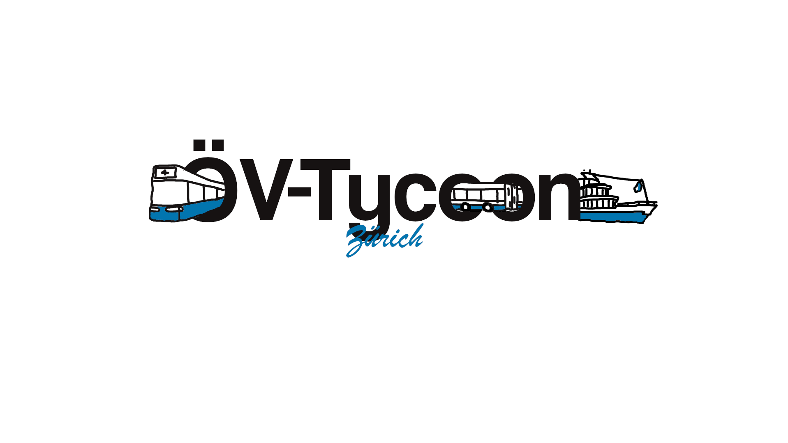
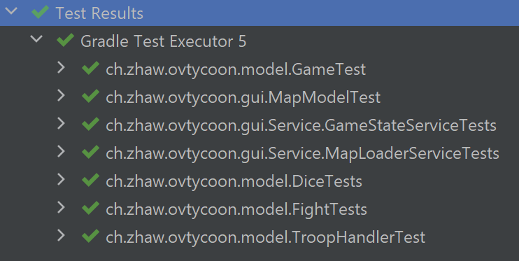
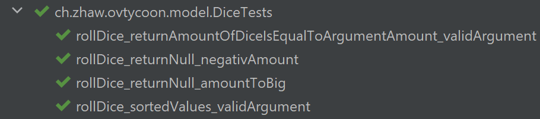
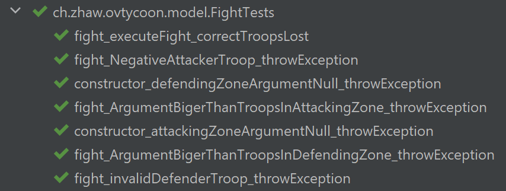
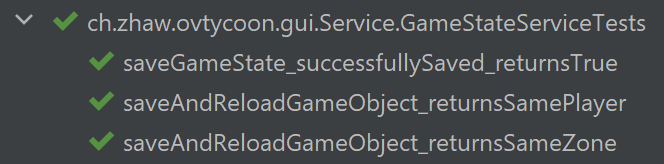
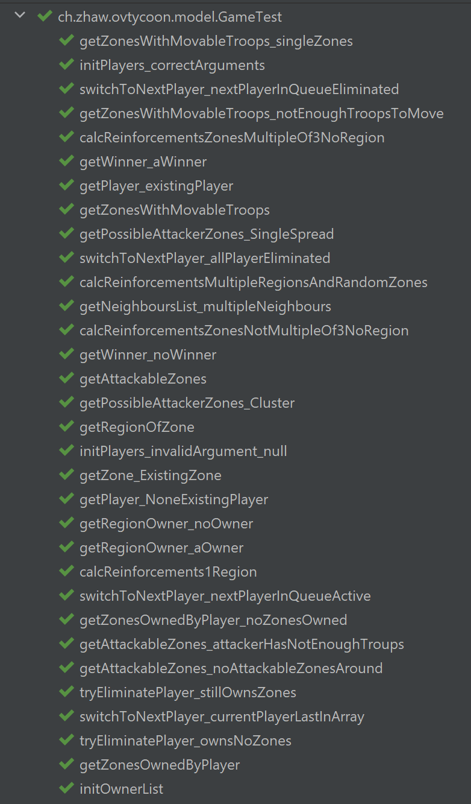
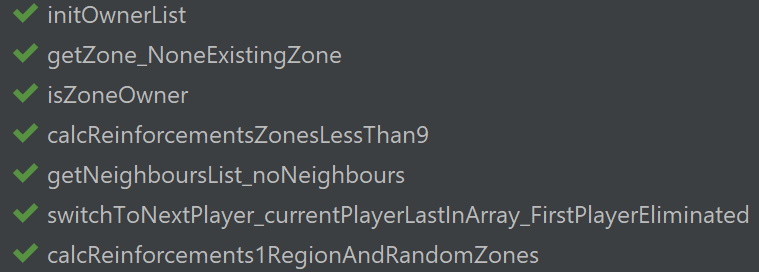
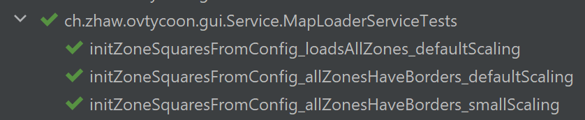
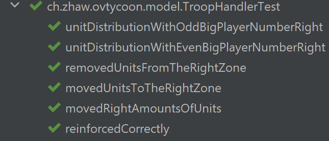

# PM3-FS22-IT20ta_ZH-Team3
## ÖV-Tycoon

### Vernetze Zürich, ein Zug nach dem anderen

### Table of contents:
1. Basic informations
2. Start the game
3. How to play
4. Additional informations
    1. Class Diagramm
    2. Test Protocol

### Basic Informations
This game is about taking over the public transport in the canton of Zurich. You'll take on the role of a boss of a public transport company. In this game, you'll be able to place trains (further on in the beta release and the documentation called "troops") in different zones of the Canton of Zurich, where you'll compete for the favor of the passengers. You'll be able to open up new zones and thus slowly build an empire over the public transport of the Canton of Zurich.

### Start the game
At the moment, the game can be startet/installed with the two method shown below:
* One method is that one can download any desired development environment and import the project there. After you have buildet the project in this development environment, you can either start the project via the 'run' button of your development environment or via the gradle-built-in via 'run'.
* The other method is, that you download and install gradle and java to your laptop. After that you can open a command line input and navigate with cd ./PM3-FS22-IT20ta_ZH-Team3 to this file path, there you can simple type in the command gradle run in your command line and the project will then automatically start up.

### How to play
#### Initialize Game
The first window, that will appear to you is the start window. There you can simple choose, if you want to start a new game, load an existing game or quit the application.
If you select new game, a new window appears, where you can select one of six diverent characters and there corresponding colors. Once everyone has choosen his avatar, you can click on 'next' and the game will setup automatically.
#### Turn
##### Setting Reinforcement
You will see the map on which every player has already received multiple randomly choosen zones and their initial troop amount was also distributed to the zones. When it is your turn and you are in possession of one complete region, which contains multiple zones who are groupped with thicker outlining in the game map, you can on the start of your turn set 5 troops to one or distributed to multiple zones which you possess.
##### Attacking
After the setting of your troops you can attack an desired neighbour of one of your own zones. You can attack with a maximum of 3 troops, whetever the defender can choose to defend with one or with maximum two troops (if available). When the attacking and defending troops are set up, the fight will happen automatically, for that every unit will make a dice roll and the attacking and defending dices will be compared. The respectively higher dices win and the loosing unit will be romved from the field.
If the defender runs out of troop units and you have still some units left, you take over the zone and can then directly move some units from your attacking zone to the new taken zone, but you have to at least move one unit.
When the attacker has just one troop unit left in his attacking zone, then he can no longer attack this or another new zone.
You can attack as many times you want but just until you have one troop left in every zone you own.
##### Movement
When you dont want to attack anymore, you can move your troops. In this phase you can chose one zone which you own, from where you want to move some troop units away. After that some possible movement zones will highlight, to which you can move troops (they have to have a direct connection over self owned zones to the origin zone). You can select one of these zones and then select how many troops you want to move (one troop at least has to remain in the origin zone).
##### Next Player
After you hit the 'next'-Button in you movement phase, the game will switch to the next player who can choose the same options as are described on top.

### Additional Information
In the additional informations, you can find specific extra information about the project.

#### Class Diagramm
Show below is the current class diagramm of the project.

#### Test Protocol
The protocoll with all the negativ and positive Tests is shown below. You will also see the actual name of the test and to which classes the tests belong.
* Test classes overview: 
* DiceTest: 
* FightTest: 
* GameStateServiceTest:
* GameTest: 
* MapLoaderServiceTest:
* TroopHandlerTest:
#### Team/Contact
If you have further quetsions or some suggestions to improve the project, you can contact the team over the given informations below.
* Team-leader
    * Kolodziejczyk Rinchen, 		
    e-mail: kolodrin@students.zhaw.ch,		
	tel.: 076 571 85 22 			
* Deputy Team-leader
    * Brändli Yves,
    e-mail: braenyve@students.zhaw.ch,
    tel.: 076 221 46 69
* Team:
    * Bissig Simon
    * Meier Robin
    * Moser Nadine
    * Todorovic Sava
